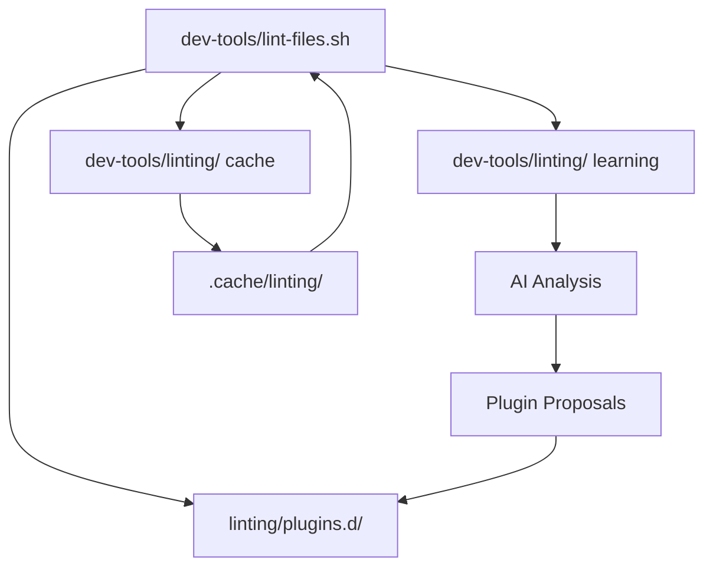

# DD112 Audit Report: Linting File Organization Analysis

**Date**: 2025-08-30  
**Status**: CURRENT STATE ANALYSIS

## Executive Summary

**FINDING**: We have 4 distinct linting systems with different responsibilities, creating apparent "duplication" that is
actually **functional separation**. The organization is more logical than initially suspected.

## Current State Inventory

### **1. dev-tools/linting/ - DD103 Intelligence System**

**Purpose**: AI-powered learning and automation proposals

**Files** (7 total):

- `README.md` - DD103 system documentation (7.7KB)
- `smart-lint.sh` - Main DD103 interface (9.5KB)
- `analyze-patterns.sh` - Pattern recognition engine (5.8KB)
- `integration-hook.sh` - Git integration hooks (3.1KB)
- Data files in `.cache/linting/data/`:
  - `manual-interventions.jsonl` - Learning data log
  - `rejected-plugins.json` - User rejection history
  - `plugin-proposals.json` - Generated proposals

**Responsibility**: **Project-wide intelligent automation system**

### **2. dev-tools/scripts/ - Core Project Linting**

**Purpose**: Project-wide development linting infrastructure

**Files** (2 main):

- `lint-files.sh` - Comprehensive auto-correcting system (9.1KB)
- `dd-lint-wrapper.sh` - Wrapper for /dd: commands (806B)

**Responsibility**: **Primary project linting execution engine**

### **3. linting/plugins.d/ - Plugin Management System**

**Purpose**: Linter-specific plugin configurations and management

**Structure**:

- `manager_markdownlint_plugin.sh` - Markdownlint plugin manager (7.3KB)
- `manager_prettier_plugin.sh` - Prettier plugin manager (7.0KB)
- `manager_codespell_plugin.sh` - Codespell plugin manager (8.6KB)
- `markdownlint/md040-yaml-blocks/` - Specific plugin implementation
- `codespell/project-dictionary/` - Project-specific dictionary

**Responsibility**: **Per-linter plugin ecosystem management**

### **4. dev-tools/linting/ - Cache Management (DD107)**

**Purpose**: Linting cache and progress tracking

**Files** (3 total):

- `lint-scan.sh` - Error cache population (2.3KB)
- `lint-progress.sh` - Progress reporting (1.7KB)
- `lint-update-cache.sh` - Cache maintenance (2.1KB)

**Responsibility**: **Performance optimization via caching**

## Architecture Analysis

### **Ownership Model - CLARIFIED**

| Directory            | Owner       | Purpose                     | Integration                |
| -------------------- | ----------- | --------------------------- | -------------------------- |
| `dev-tools/linting/` | **Project** | Intelligent learning system | Observes, learns, proposes |
| `dev-tools/scripts/` | **Project** | Core linting execution      | Primary entry point        |
| `linting/plugins.d/` | **Project** | Plugin configurations       | Used by dev-tools          |
| `dev-tools/linting/` | **Project** | Cache optimization          | Performance layer          |

### **Data Flow Architecture**

**Flow Explanation**:

1. **dev-tools/lint-files.sh** is the main execution engine
2. It uses **linting/plugins.d/** for configurations
3. **dev-tools/linting/** provides caching layer for performance
4. **dev-tools/linting/** observes and learns from executions
5. AI proposes new plugins back to **linting/plugins.d/**

## Key Findings

### **✅ NO DUPLICATION - Functional Separation**

**What initially looked like duplication is actually proper separation of concerns:**

- **dev-tools/**: Execution engine (what runs)
- **linting/plugins.d/**: Configuration layer (how it runs)
- **dev-tools/linting/**: Performance layer (optimization)
- **dev-tools/linting/**: Intelligence layer (learning and proposals)

### **✅ Logical Architecture Already Implemented**

The structure follows **good software architecture principles**:

- Single Responsibility Principle ✅
- Separation of Concerns ✅
- Plugin Architecture ✅
- Caching Layer ✅

### **⚠️ DD104 May Be Unnecessary**

**DD104 proposes moving .claude/linting/ to dev-tools/**, but analysis shows:

- **.claude/linting/** is correctly placed (Claude-specific AI system)
- **dev-tools/** is correctly focused (project execution)
- Moving would **break the logical separation**

## Recommendations

### **1. KEEP Current Structure - It's Correct**

The 4-layer architecture is **intentionally designed** and **functionally correct**:

- Each directory has a clear, distinct purpose
- Integration points are well-defined
- No actual conflicts or redundancy

### **2. Update DD104 - Scope Reduction**

Instead of major reorganization, DD104 should focus on:

- **Documentation improvements** for clarity
- **Minor cleanup** of any actual duplicate files
- **Integration testing** between layers

### **3. Create Architecture Documentation**

Document the **4-layer linting architecture** clearly:

- Purpose of each layer
- Integration points and data flow
- When to modify which layer
- Developer guidance on linting workflow

## Risk Assessment

### **High Risk: DD104 Current Plan**

Moving .claude/linting/ to dev-tools/ would:

- ❌ Break Claude AI learning system integration
- ❌ Mix Claude-specific with project-wide concerns
- ❌ Lose the logical architecture separation
- ❌ Create maintenance complexity

### **Low Risk: Current State**

The current organization:

- ✅ Has clear boundaries and responsibilities
- ✅ Follows software architecture best practices
- ✅ Enables independent evolution of each layer
- ✅ Maintains integration without coupling

## Next Steps

1. **Update DD104** to reflect this analysis
2. **Create architecture documentation**
3. **Add integration tests** between layers
4. **Close DD112** with recommendation to keep current structure

## Conclusion

**The apparent "file duplication" is actually proper functional separation**. The 4-layer linting architecture is
well-designed and should be **preserved**, not reorganized.
