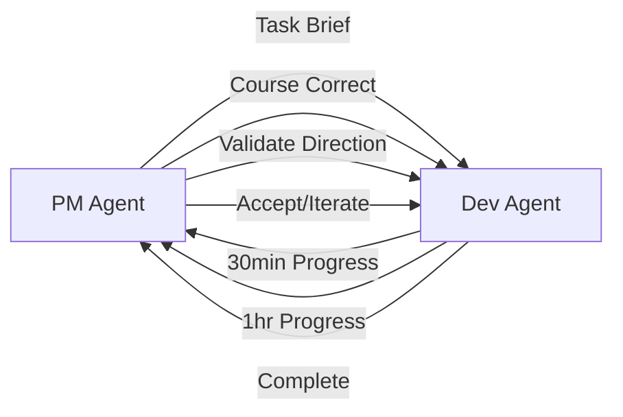

# DD099 - Agile Workflow Evaluation: PM-Dev Feedback Loops to Avoid Code Tunnels

**Status**: PROPOSED  
**Priority**: HIGH ⭐ (Critical for multi-agent system success)  
**Dependencies**: DD093 (PM Team), DD091 (PM Agent)  
**Epic**: EDD091 (DOH-DEV Multi-Agent Development System)

Design and implement agile feedback loops between PM agents and Dev agents to prevent code tunnels and ensure continuous
alignment with project vision.

## Problem Statement

### **The Code Tunnel Problem**

Dev agents can enter "code tunnels" where they:

- Focus intensely on implementation details
- Lose sight of the macro project vision
- Diverge from original requirements
- Over-engineer solutions
- Miss simpler alternatives
- Create technically correct but business-wrong solutions

### **Why This Happens**

- **Limited Context Window**: Dev agents work with specific task context
- **No Macro View**: Devs don't see the full project roadmap
- **Missing Feedback**: No regular PM check-ins during development
- **Late Discovery**: Problems found only after implementation complete

## Proposed Solution: Agile PM-Dev Feedback Loops

### **1. Micro-Sprint Architecture** (2-hour cycles)



### **2. Continuous Alignment Protocol**

#### **Sprint Start (PM → Dev)**

```yaml
task_brief:
  task_id: DD088
  business_goal: "Simplify linting for developers"
  key_outcomes:
    - Unified backend usage
    - Single-file support
    - Git workflow integration
  anti_patterns:
    - Complex AI pipelines
    - Over-engineered solutions
    - Breaking existing workflows
  success_metrics:
    - Execution time < 1s
    - Zero learning curve
    - Compatible with existing commands
```

#### **Progress Checkpoints (Dev → PM)**

```yaml
progress_update:
  elapsed: 30min
  completed:
    - Analyzed current complexity
    - Identified unified script exists
  current_approach: "Wrap existing lint-files.sh"
  blockers: none
  questions:
    - "Should we preserve AI features?"
    - "Is backwards compatibility required?"
```

#### **Course Correction (PM → Dev)**

```yaml
feedback:
  direction: APPROVED_WITH_CHANGES
  guidance:
    - "Remove all AI features - simplicity first"
    - "100% backwards compatible required"
    - "Focus on wrapper, not reimplementation"
  priority_reminder: "Developer experience > features"
```

### **3. Anti-Tunnel Mechanisms**

#### **A. Divergence Detection**

```python
def detect_divergence(task_brief, current_implementation):
    """PM Agent monitors for scope creep"""

    divergence_signals = [
        "New dependencies added not in brief",
        "Implementation time > 2x estimate",
        "New features not in requirements",
        "Complex abstractions for simple problems",
        "Breaking changes to existing APIs"
    ]

    if any(signal in current_implementation for signal in divergence_signals):
        trigger_pm_review()
```

#### **B. Incremental Validation**

```yaml
validation_gates:
  - gate_1: "Architecture Review" (15 min)
  - gate_2: "Partial Implementation" (30 min)
  - gate_3: "Integration Check" (45 min)
  - gate_4: "Complete Review" (60 min)

  fail_fast: true  # Stop immediately if off-track
```

#### **C. Pair Programming Simulation**

```markdown
## Virtual Pair Programming Protocol

**Navigator (PM Agent)**:

- Maintains strategic vision
- Asks "why" questions
- Suggests simpler alternatives
- Catches over-engineering

**Driver (Dev Agent)**:

- Implements tactical solutions
- Explains technical decisions
- Raises feasibility concerns
- Proposes implementation details

**Switch Roles**: Every 30 minutes for perspective
```

### **4. Communication Patterns**

#### **Pattern A: Question-First Development**

Dev agents must ask before assuming:

```
Dev: "The task mentions 'unified backend'. Should I create one or use existing?"
PM: "Check if one exists first. Use existing if possible."
Dev: "Found dev-tools/scripts/lint-files.sh. Should I wrap or replace?"
PM: "Wrap it. Simplicity over reimplementation."
```

#### **Pattern B: Show Don't Tell**

Quick prototypes over long explanations:

```
Dev: "Here's a 10-line wrapper around lint-files.sh. Does this meet the need?"
PM: "Perfect. Ship it. Don't add more features."
```

#### **Pattern C: Red Flag Escalation**

Immediate PM involvement triggers:

- Adding new dependencies
- Changing existing APIs
- Implementation taking >2x estimate
- Architectural decisions needed
- Scope expansion temptations

### **5. Implementation Checklist**

- [ ] **Define sprint cycles**: 2-hour micro-sprints with 4 checkpoints
- [ ] **Create communication protocol**: Structured updates between agents
- [ ] **Implement divergence detection**: Auto-detect when dev goes off-track
- [ ] **Add validation gates**: PM reviews at 25%, 50%, 75%, 100%
- [ ] **Build feedback loops**: Dev can query PM mid-implementation
- [ ] **Create pair programming mode**: PM-Dev work together on complex tasks
- [ ] **Add retrospectives**: Learn from each sprint to improve
- [ ] **Define escalation paths**: When to involve human oversight

## Success Metrics

### **Quantitative**

- **Rework Rate**: <10% of implementations need major changes
- **Alignment Score**: 90%+ implementations match original vision
- **Cycle Time**: Average task completion in <2 hours
- **Divergence Catches**: 100% of scope creep detected early

### **Qualitative**

- **PM Satisfaction**: "Devs understand business goals"
- **Dev Satisfaction**: "Clear requirements, fast feedback"
- **Code Quality**: Simple, maintainable, focused solutions
- **Business Value**: Features solve actual user problems

## Example Workflow: DD088 Implementation

```yaml
sprint_1:
  start:
    pm_brief: "Make /dd:lint use unified script"
    time_box: 2_hours

  checkpoint_1: # 30 min
    dev: "Found existing lint-files.sh with all features"
    pm: "Great! Wrap it, don't rewrite"

  checkpoint_2: # 60 min
    dev: "Created wrapper, preserved essential features"
    pm: "Show me usage examples"

  checkpoint_3: # 90 min
    dev: "/dd:lint --modified works, wraps lint-files.sh"
    pm: "Perfect. Test backwards compatibility"

  checkpoint_4: # 120 min
    dev: "All tests pass, no breaking changes"
    pm: "Ship it. Well done staying focused"

  result: SUCCESS
  rework: none
  alignment: 100%
```

## Anti-Patterns to Avoid

### **❌ The Deep Dive**

```
Dev disappears for 8 hours, returns with complex over-engineered solution
```

### **❌ The Assumption Chain**

```
Dev assumes A → implements B → requires C → creates D → original need lost
```

### **❌ The Feature Creep**

```
Task: Add button
Result: New UI framework, state management, animation library
```

### **❌ The Perfectionist Spiral**

```
Dev refactors endlessly seeking "perfect" code, never ships
```

## Deliverable

A robust agile workflow system that ensures PM-Dev alignment through:

- Frequent micro-checkpoints preventing code tunnels
- Clear communication protocols reducing assumptions
- Early divergence detection avoiding rework
- Pair programming dynamics for complex tasks
- Continuous business value validation

**Result**: Dev agents stay aligned with business goals while maintaining technical excellence.
