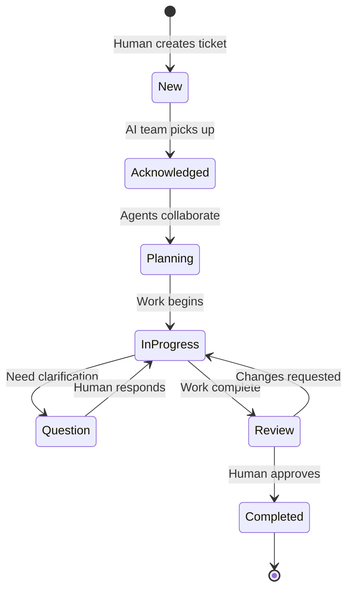

# DD102 - Human-Agent Interaction Management: Asynchronous Ticketing System

**Status**: PROPOSED  
**Priority**: HIGH ⭐⭐ (Critical for real-world deployment)  
**Dependencies**: DD099 (Agile Workflow), DD101 (Benchmark)  
**Epic**: EDD091 (DOH-DEV Multi-Agent Development System)

Design and implement an asynchronous ticketing/issue system for optimal human-agent collaboration, enabling background
processing while respecting human time.

## Problem Statement

### **The Synchronous Trap**

Current AI interactions are synchronous:

- Human waits while AI works
- AI waits while human is away
- No parallel processing
- Frustrating for complex tasks
- Waste of both human and AI time

### **The Background Processing Opportunity**

- AI can work 24/7 without breaks
- Humans have limited attention spans
- Most dev work doesn't need real-time interaction
- Complex tasks benefit from deep work time

## Proposed Solution: Async Ticketing System

### **Core Concept: GitHub Issues/Jira for AI Agents**

```yaml
interaction_model:
  human_creates_ticket:
    time: 2 minutes
    action: "Describe need, attach context"

  ai_acknowledges:
    time: 30 seconds
    action: "Confirm understanding, estimate time"

  human_leaves:
    action: "Goes to bed / other work"

  ai_works:
    time: 8-24 hours
    action: "Deep work, multiple agents collaborate"

  ai_updates_ticket:
    frequency: Major milestones
    action: "Post progress, request clarification if needed"

  human_reviews:
    time: 5 minutes
    action: "Check progress, provide feedback"
    when: "At their convenience"
```

## System Architecture

### **1. Ticket Structure**

```typescript
interface AITicket {
  id: string;
  title: string;
  description: string;

  // Human Input
  requirements: string;
  priority: "urgent" | "high" | "normal" | "low";
  deadline?: Date;
  attachments: File[];

  // AI Management
  status: "new" | "acknowledged" | "in_progress" | "review" | "completed";
  assignedAgents: Agent[];
  estimatedTime: Duration;
  actualTime?: Duration;

  // Communication
  updates: Update[];
  questions: Question[];
  deliverables: Deliverable[];

  // Quality
  testResults?: TestResults;
  codeReview?: Review;
  documentation?: Docs;
}
```

### **2. Workflow States**



### **3. Agent Team Assignment**

```yaml
ticket_routing:
  feature_request:
    agents: [PM, Architect, Backend, Frontend, QA]
    workflow: full_development

  bug_fix:
    agents: [Analyzer, Developer, QA]
    workflow: quick_fix

  documentation:
    agents: [Technical Writer, Developer]
    workflow: docs_only

  refactoring:
    agents: [Architect, Senior Dev, QA]
    workflow: code_improvement

  research:
    agents: [PM, Architect]
    workflow: exploration
```

## Implementation Examples

### **Example 1: Feature Development Ticket**

```markdown
# Ticket #001: Add Export to PDF Feature

**Created by**: Human **Time**: 2024-01-15 22:30 (before bed)

## Description

Need to export association member list as PDF with formatting.

## Requirements

- Table format with headers
- Include member photo if available
- Page numbers and date
- Association logo on header

## Priority: Normal

**Deadline**: End of week

---

### AI Team Response (22:31)

**Acknowledged by**: PM Agent **Team Assigned**: PM, Backend, Frontend, DevOps **Estimated Time**: 6-8 hours

We'll work on this overnight. Key decisions:

1. PDF library selection (researching options)
2. Template system for formatting
3. Storage for generated PDFs

Will update by morning with implementation plan.

---

### Update 1 (02:45)

**From**: Backend Agent **Status**: In Progress

Implemented PDF generation service:

- Using PDFKit for generation
- Template system with Handlebars
- S3 storage for generated files
- API endpoint: POST /api/exports/members/pdf

Currently working on frontend integration.

---

### Update 2 (06:30)

**From**: QA Agent  
**Status**: Review Ready

Feature complete with:

- ✅ PDF generation working
- ✅ 15 unit tests passing
- ✅ 3 E2E tests passing
- ✅ Responsive UI
- ✅ Error handling
- ✅ Documentation updated

[Preview PDF](link) | [Test Report](link) | [PR #123](link)

Ready for your review when you wake up!

---

### Human Review (08:00)

Looks great! One change:

- Can we add a watermark option for draft exports?

---

### Update 3 (08:45)

**From**: Backend Agent **Status**: Completed

✅ Watermark feature added

- Optional "DRAFT" watermark
- Configurable opacity and position
- Tests updated

[Final PR #123](link) ready to merge.
```

### **Example 2: Bug Investigation Ticket**

````markdown
# Ticket #002: Payment Processing Failing Randomly

**Created by**: Human  
**Time**: Friday 17:00

## Description

Some members report payment failures but it works when they retry.

## Known Info

- Happens ~10% of the time
- No pattern identified
- Started last week

## Priority: URGENT

---

### AI Team Response (17:01)

**Acknowledged by**: Code Analyzer Agent **Team**: Analyzer, Backend Dev, DevOps **Action**: Starting investigation
immediately

Will analyze logs and payment flow. Updates every hour.

---

### Question (18:30)

**From**: Analyzer Agent

Found potential race condition in payment webhook handler.

Questions:

1. Did you change webhook timeout settings recently?
2. Are you using webhook retry mechanism?
3. Can I spin up test environment to reproduce?

**Human offline - continuing investigation**

---

### Update (Saturday 09:00)

**From**: Backend Agent **Status**: Root Cause Found

## Investigation Complete

**Root Cause**: Race condition between webhook and database transaction

**Timeline**:

- 17:00-19:00: Log analysis (found 47 failures)
- 19:00-22:00: Traced payment flow
- 22:00-02:00: Reproduced in test environment
- 02:00-04:00: Identified race condition
- 04:00-08:00: Developed and tested fix

**Solution Implemented**:

```javascript
// Added distributed lock
await acquireLock(`payment_${transactionId}`);
try {
  await processPayment();
} finally {
  await releaseLock(`payment_${transactionId}`);
}
```
````

**Testing**:

- Processed 10,000 test payments
- 0% failure rate (was 10.3%)
- No performance impact

[Fix PR #456](link) | [RCA Document](link)

````

## Ticketing System Features

### **1. Smart Prioritization**

```python
def calculate_priority(ticket):
    score = 0

    # User-defined priority
    score += priority_weights[ticket.priority]

    # Deadline urgency
    if ticket.deadline:
        hours_until = (ticket.deadline - now).hours
        score += max(0, 100 - hours_until)

    # Business impact
    if 'production' in ticket.tags:
        score += 50
    if 'security' in ticket.tags:
        score += 100

    # Complexity estimation
    score -= ticket.estimated_complexity * 10

    return score
````

### **2. Agent Workload Balancing**

```yaml
agent_availability:
  backend_agent:
    current_tickets: 3
    capacity: 5
    specialties: [python, api, database]

  frontend_agent:
    current_tickets: 1
    capacity: 5
    specialties: [react, ui, css]

ticket_assignment:
  algorithm: "least_loaded_with_expertise"
  rebalance: every_hour
```

### **3. Human Notification System**

```yaml
notifications:
  urgent_issues:
    channel: push_notification
    when: immediately

  questions_from_ai:
    channel: email
    when: batched_hourly

  completion:
    channel: email
    when: immediately

  progress_updates:
    channel: web_ui
    when: on_demand

  daily_summary:
    channel: email
    when: 9am_local_time
```

### **4. Quality Gates**

```yaml
auto_quality_checks:
  before_marking_complete:
    - tests_pass: required
    - code_coverage: ">80%"
    - linting_clean: required
    - security_scan: no_criticals
    - documentation: updated
    - peer_review: completed
```

## Integration with Development Workflow

### **1. GitHub Integration**

```yaml
github_sync:
  ticket_created:
    action: create_github_issue
    labels: [ai-managed, auto-generated]

  ai_progress:
    action: update_issue_comments

  pr_created:
    action: link_to_ticket

  human_review:
    action: sync_comments_bidirectional
```

### **2. IDE Plugin**

```typescript
// VS Code Extension
class AITicketPanel {
  showActiveTickets() {
    // Display tickets in sidebar
  }

  createTicket() {
    // Quick ticket creation from code
  }

  reviewDeliverable() {
    // Inline code review from AI
  }
}
```

### **3. CLI Integration**

```bash
# Create ticket from command line
$ ai-ticket create "Add user authentication"

# Check status
$ ai-ticket status
  #001 [IN_PROGRESS] Add PDF export (75% complete)
  #002 [REVIEW] Fix payment race condition (awaiting approval)
  #003 [PLANNING] User authentication (starting in 2h)

# Quick review
$ ai-ticket review 002
  Opening PR diff in browser...

# Approve and merge
$ ai-ticket approve 002 --merge
```

## Success Metrics

### **Efficiency Metrics**

- **Human time saved**: 90% reduction in active waiting
- **Ticket resolution time**: 24h average (working continuously)
- **Parallel tickets**: 5-10 simultaneous (vs 1 synchronous)
- **Context switching**: Reduced by 80%

### **Quality Metrics**

- **First-time approval**: 85% of tickets need no rework
- **Test coverage**: 90%+ on all deliverables
- **Documentation**: 100% updated
- **Bug introduction**: <5% in AI-developed features

### **Human Satisfaction Metrics**

- **Response time**: <5 min for urgent issues
- **Work-life balance**: Can submit tickets anytime
- **Cognitive load**: Reduced by batching reviews
- **Trust level**: High due to quality gates

## Implementation Roadmap

### **Phase 1: Basic Ticketing** (MVP)

- Simple ticket creation/update system
- Basic agent assignment
- Status tracking
- Email notifications

### **Phase 2: Smart Features**

- Multi-agent collaboration
- Automatic prioritization
- Workload balancing
- Quality gates

### **Phase 3: Integrations**

- GitHub sync
- IDE plugins
- CLI tools
- Web dashboard

### **Phase 4: Advanced AI**

- Predictive time estimation
- Auto-ticket creation from errors
- Proactive suggestions
- Learning from feedback

## Example Daily Workflow

```yaml
human_morning_routine:
  08:00:
    - Check overnight ticket progress
    - Review 3 completed tickets (15 min)
    - Approve 2, request changes on 1

  08:15:
    - Create 2 new tickets for today's needs
    - Set priorities and deadlines

  08:20:
    - Back to other work

ai_team_continuous:
  08:20-17:00:
    - Work on 5 tickets in parallel
    - Post updates on major milestones
    - Handle the change request

human_evening_check:
  17:00:
    - Quick review of progress (5 min)
    - Answer any blocking questions
    - Adjust priorities if needed

ai_team_overnight:
  17:05-08:00:
    - Complete feature development
    - Run comprehensive tests
    - Generate documentation
    - Prepare for morning review
```

## Deliverable

A complete asynchronous ticketing system that:

- **Maximizes AI utilization** (24/7 processing)
- **Minimizes human waiting** (async by default)
- **Maintains quality** (automated gates)
- **Enables scale** (parallel processing)
- **Improves experience** (work at your own pace)

**Result**: Transform AI development from frustrating synchronous waiting to efficient asynchronous collaboration, where
humans provide direction and AI provides continuous execution.
