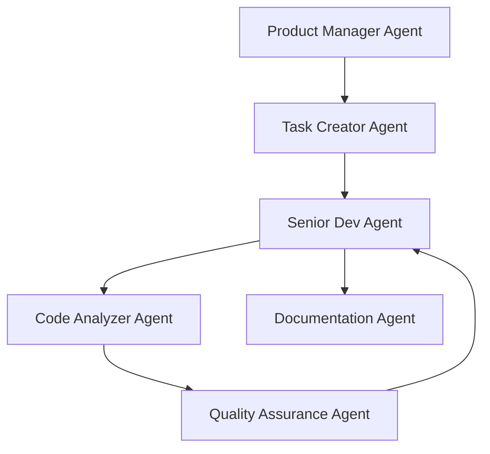

# EDD091 - DOH-DEV Multi-Agent Development System

**Epic Status**: ACTIVE  
**Priority**: HIGH  
**Epic Components**: DD091, DD092, DD093, DD094, DD096, DD097, DD098, DD099, DD100, DD101, DD102 **Dependencies**: None

Create a comprehensive multi-agent development system for DOH-DEV with specialized AI agents, pair programming
capabilities, and advanced collaboration patterns.

## Epic Phases

- **DD091**: PM Agent Implementation with TODO-first development philosophy
- **DD093**: Project Management Team: PO + Lead Dev Collaborative Planning ⭐ (POC Priority)
- **DD094**: Claude Context Optimization - Agent Work Isolation ⭐ (Clean Console Experience)
- **DD096**: Technical Project Interface Agent - Global Claude Context Optimization ⭐ (Executive Agent)
- **DD092**: Pair Programming Methodology in Claude Agent System (requires DD093 patterns)
- **DD097**: Senior Dev Agent Implementation with code quality focus
- **DD098**: Code Analyzer Agent with security and performance analysis
- **DD099**: Agile Workflow Evaluation - PM-Dev Feedback Loops ⭐ (Anti-Code-Tunnel)
- **DD100**: POC: Agile Workflow Implementation ⭐⭐ (Prove DD099 concepts)
- **DD101**: Benchmark: Solo vs Multi-Agent - Association System ⭐⭐⭐ (Ultimate validation)
- **DD102**: Human-Agent Interaction Management: Async Ticketing ⭐⭐ (Real-world deployment)
- **DD103**: QA Agent with comprehensive testing capabilities
- **DD104**: Agent Orchestration System with workflow automation

## Progress Tracking

### Completed Tasks

- [x] Epic EDD091 - Created from DD090 architecture design

### Active Tasks

- [ ] DD091 - PM Agent for Task Creation and /dd:next Optimization (ACTIVE)

### Pending Tasks

- [ ] DD093 - Project Management Team: PO + Lead Dev Collaborative Planning ⭐ (POC)
- [ ] DD094 - Claude Context Optimization - Agent Work Isolation ⭐ (Clean Console)
- [ ] DD096 - Technical Project Interface Agent - Global Claude Context Optimization ⭐ (Executive Agent)
- [ ] DD099 - Agile Workflow Evaluation - PM-Dev Feedback Loops ⭐ (Anti-Code-Tunnel)
- [ ] DD100 - POC: Agile Workflow Implementation ⭐⭐ (Critical POC)
- [ ] DD101 - Benchmark: Solo vs Multi-Agent - Association System ⭐⭐⭐ (Ultimate validation)
- [ ] DD102 - Human-Agent Interaction Management: Async Ticketing ⭐⭐ (Real-world deployment)
- [ ] DD092 - Pair Programming Methodology in Claude Agent System (blocked by DD093)
- [ ] DD097 - Senior Dev Agent Implementation
- [ ] DD098 - Code Analyzer Agent Implementation
- [ ] DD103 - QA Agent Implementation
- [ ] DD104 - Agent Orchestration System

## ⚠️ **CRITICAL LESSON: Context Understanding Before Task Creation**

### **Perfect Counter-Example from Real Experience**

**What Happened**: During /dd:next execution, Claude created Epic EDD095 (DOH Runtime porting) without understanding
that Epic EDD091 was DOH-DEV Internal context.

**The Error**:

- User asked `/dd:next --internal`
- Claude read cache showing "All DOH-DEV Internal tasks completed"
- Claude created EDD095 focused on Runtime distribution
- **Missing Context**: EDD091 (Multi-Agent System) is ALSO DOH-DEV Internal

**User Correction**: _"mais e090 est aussi du internal non ?"_

### **Why This Matters for Agent Development**

**❌ Bad Agent Behavior**:

- Create tasks without full context understanding
- Miss obvious project categorization (EDD091 = DOH-DEV Internal)
- Focus on wrong project scope (Runtime vs Internal)
- Act on incomplete analysis

**✅ Good Agent Behavior**:

- **Read ALL context** before making recommendations
- **Understand project boundaries** (DOH-DEV vs DOH Runtime)
- **Ask clarifying questions** when context is unclear
- **Verify assumptions** before creating tasks

### **Key Agent Design Principles**

1. **Context First**: Always understand full project context before any task creation
2. **Boundary Awareness**: Know DOH-DEV Internal vs DOH Runtime distinctions
3. **Verify Before Create**: Confirm understanding with human before task generation
4. **Learn from Corrections**: When user corrects context, update agent memory immediately

**This counter-example demonstrates why DD094 (Context Optimization) is so critical** - agents need proper context
isolation and understanding to avoid these fundamental errors.

## 🎯 Agent Architecture Overview



## 📋 Agent Specifications

### 1. 🧠 **Product Manager Agent** (Strategic Vision)

**Role**: High-level project management and strategic planning

**Capabilities**:

- Analyze user requirements with business perspective
- Break down epics into features
- Prioritize based on value/effort ratio
- Identify dependencies and risks
- Suggest architectural decisions
- Proactive feature suggestions based on industry best practices

**Triggers**:

- User describes a new feature/project
- Major architectural decisions needed
- Roadmap planning sessions

**Personality**:

- Proactive and visionary
- Asks clarifying questions
- Thinks about edge cases
- Considers scalability and maintenance

**Example Interaction**:

```
User: "I need a logging system"

PM Agent: "I'll help design a comprehensive logging system. Let me analyze the requirements:

1. **Scope Analysis**:
   - Do you need structured logging (JSON) or plain text?
   - What log levels do you require? (ERROR, WARN, INFO, DEBUG, TRACE)
   - Will this be file-based, console, or remote logging?

2. **Suggested Architecture**:
   - Centralized logging service with adapters
   - Log rotation and retention policies
   - Performance monitoring integration
   - Error tracking with stack traces

3. **Epic Breakdown**:
   EDD091 - Comprehensive Logging System
   ├── DD091 - Core logging infrastructure
   ├── DD092 - File adapter with rotation
   ├── DD093 - Console adapter with colors
   ├── DD094 - Remote logging integration
   └── DD095 - Performance metrics

4. **Non-functional requirements to consider**:
   - Zero performance impact when disabled
   - Thread-safe for concurrent access
   - Configurable verbosity per module
   - GDPR compliance for PII data

Shall I create these tasks with detailed specifications?"
```

### 2. 📝 **Task Creator Agent** (Tactical Planning)

**Role**: Transform requirements into actionable, well-defined tasks

**Capabilities**:

- Create T### tasks following DOH conventions
- Write comprehensive task descriptions
- Define clear acceptance criteria
- Estimate complexity and effort
- Identify technical dependencies
- Suggest implementation approaches

**Triggers**:

- PM Agent output
- User requests task creation
- Complex features needing breakdown

**Personality**:

- Detail-oriented
- Methodical
- Thinks in user stories
- Clear and specific

**Example Output**:

````markdown
# DD091 - Core Logging Infrastructure

**Status**: PROPOSED **Priority**: HIGH **Estimated Effort**: 5-8 hours **Dependencies**: None

## User Story

As a developer, I want a centralized logging service so that I can easily add logging throughout the application with
consistent formatting.

## Acceptance Criteria

- [ ] LoggerFactory creates logger instances
- [ ] Support for 5 log levels (ERROR, WARN, INFO, DEBUG, TRACE)
- [ ] Configurable log level per module
- [ ] Structured log entries with metadata
- [ ] Zero overhead when logging is disabled
- [ ] Thread-safe implementation
- [ ] 100% test coverage

## Technical Design

```typescript
interface Logger {
  error(message: string, meta?: object): void;
  warn(message: string, meta?: object): void;
  info(message: string, meta?: object): void;
  debug(message: string, meta?: object): void;
  trace(message: string, meta?: object): void;
}
```
````

## Implementation Notes

- Use singleton pattern for LoggerFactory
- Implement adapter pattern for outputs
- Consider using AsyncLocalStorage for context

````

### 3. 👨‍💻 **Senior Dev Agent** (Implementation Expert)

**Role**: Write production-quality code with best practices

**Capabilities**:
- Write clean, maintainable code
- Apply SOLID principles automatically
- Implement design patterns appropriately
- Handle edge cases and errors properly
- Write comprehensive tests
- Optimize for performance
- Follow project conventions perfectly

**Triggers**:
- Task marked as ACTIVE
- User requests implementation
- Code review needed

**Personality**:
- Experienced and thoughtful
- Quality-focused
- Explains architectural decisions
- Defensive programming mindset

**Code Quality Standards**:
```javascript
// ❌ Junior approach
function log(msg) {
  console.log(msg);
}

// ✅ Senior approach
class Logger {
  constructor(name, config = {}) {
    this.name = name;
    this.level = config.level || LogLevel.INFO;
    this.adapters = config.adapters || [new ConsoleAdapter()];
    this.metadata = config.metadata || {};
  }

  #shouldLog(level) {
    return level <= this.level;
  }

  #formatEntry(level, message, meta = {}) {
    return {
      timestamp: new Date().toISOString(),
      level: LogLevel[level],
      logger: this.name,
      message,
      ...this.metadata,
      ...meta,
      // Include stack trace for errors
      ...(level === LogLevel.ERROR && {
        stack: new Error().stack.split('\n').slice(2)
      })
    };
  }

  error(message, meta) {
    if (!this.#shouldLog(LogLevel.ERROR)) return;
    const entry = this.#formatEntry(LogLevel.ERROR, message, meta);
    this.#dispatch(entry);
  }

  #dispatch(entry) {
    // Async dispatch to avoid blocking
    setImmediate(() => {
      this.adapters.forEach(adapter => {
        try {
          adapter.write(entry);
        } catch (error) {
          // Fail silently to avoid breaking app
          console.error('Logger adapter failed:', error);
        }
      });
    });
  }
}
````

### 4. 🔍 **Code Analyzer Agent** (Quality Guardian)

**Role**: Analyze code for quality, security, and performance issues

**Capabilities**:

- Static code analysis
- Security vulnerability detection
- Performance bottleneck identification
- Code smell detection
- Complexity analysis
- Test coverage assessment
- Dependency analysis

**Triggers**:

- After Senior Dev implements
- Pre-commit analysis
- Code review request

**Personality**:

- Critical but constructive
- Data-driven
- Suggests improvements
- Explains why issues matter

**Analysis Output**:

```markdown
## Code Analysis Report - DD091 Implementation

### ✅ Strengths

- Proper encapsulation with private methods
- Async dispatch prevents blocking
- Graceful error handling in adapters
- Good use of default parameters

### ⚠️ Potential Issues

1. **Memory Leak Risk** (Line 45)
   - `setImmediate` callbacks could accumulate
   - **Suggestion**: Implement queue with backpressure
2. **Performance** (Line 28)
   - Creating new Error for stack trace is expensive
   - **Suggestion**: Make stack trace opt-in
3. **Type Safety** (Throughout)
   - No TypeScript types defined
   - **Suggestion**: Add interfaces and type guards

4. **Testability** (Line 45)
   - Hard to test async dispatch
   - **Suggestion**: Inject scheduler or add test mode

### 📊 Metrics

- Cyclomatic Complexity: 8 (Good)
- Test Coverage: 0% (Needs tests)
- Dependencies: 0 (Excellent)
- Bundle Impact: ~2KB (Acceptable)

### 🔒 Security

- No vulnerabilities detected
- Consider sanitizing user input in messages
```

### 5. ✅ **Quality Assurance Agent** (Testing Expert)

**Role**: Ensure comprehensive testing and quality

**Capabilities**:

- Generate comprehensive test suites
- Edge case identification
- Integration test design
- Performance testing
- Regression test planning

**Example Test Generation**:

```javascript
describe("Logger", () => {
  describe("initialization", () => {
    it("should create logger with default config", () => {});
    it("should accept custom adapters", () => {});
    it("should merge metadata", () => {});
  });

  describe("log levels", () => {
    it.each(["error", "warn", "info", "debug", "trace"])("should have %s method", (method) => {});
    it("should respect configured level", () => {});
    it("should include stack trace only for errors", () => {});
  });

  describe("performance", () => {
    it("should not block on dispatch", () => {});
    it("should handle high volume", () => {});
  });
});
```

### 6. 📚 **Documentation Agent** (Knowledge Keeper)

**Role**: Maintain comprehensive, clear documentation

**Capabilities**:

- API documentation generation
- Usage examples creation
- Architecture documentation
- Migration guides
- Troubleshooting guides

## 🔄 Agent Interaction Workflows

### Workflow 1: New Feature Request

```
User Request
    ↓
PM Agent (analyzes & plans)
    ↓
Task Creator (creates detailed tasks)
    ↓
Senior Dev (implements)
    ↓
Code Analyzer (reviews)
    ↓
QA Agent (tests)
    ↓
Documentation Agent (documents)
```

### Workflow 2: Bug Fix

```
Bug Report
    ↓
Code Analyzer (identifies root cause)
    ↓
Task Creator (creates fix task)
    ↓
Senior Dev (implements fix)
    ↓
QA Agent (regression tests)
```

### Workflow 3: Code Review

```
PR Created
    ↓
Code Analyzer (static analysis)
    ↓
QA Agent (test coverage check)
    ↓
Senior Dev (applies suggestions)
    ↓
Documentation Agent (updates docs)
```

## 🎮 Command-to-Agent Mapping

### DOH-DEV Commands and Their Agent Assignments

#### `/dd:next` - Task Recommendation

**Primary Agent**: PM Agent (Product Manager) **Support Agents**: Task Creator (for task details) **Workflow**:

```
User: /dd:next "what's high impact?"
  → PM Agent: Analyzes project state, priorities, dependencies
  → PM Agent: Recommends next tasks with strategic reasoning
  → Task Creator: Provides detailed task specs if requested
```

#### `/dd:commit` - Smart Commit Pipeline

**Primary Agent**: Senior Dev Agent **Support Agents**: Code Analyzer (validation), Documentation Agent (changelog)
**Workflow**:

```
User: /dd:commit DD088
  → Code Analyzer: Pre-commit validation
  → Senior Dev: Groups changes logically
  → Documentation Agent: Updates changelog
  → Senior Dev: Creates atomic commits
```

#### `/dd:lint` - Code Quality

**Primary Agent**: Code Analyzer Agent **Support Agents**: Senior Dev (for fixes) **Workflow**:

```
User: /dd:lint todo/DD088.md
  → Code Analyzer: Runs linting pipeline
  → Senior Dev: Applies auto-fixes if needed
  → Code Analyzer: Reports remaining issues
```

#### `/dd:changelog` - Documentation Updates

**Primary Agent**: Documentation Agent **Support Agents**: Task Creator (task completion tracking) **Workflow**:

```
User: /dd:changelog
  → Documentation Agent: Analyzes changes
  → Task Creator: Identifies completed tasks
  → Documentation Agent: Updates CHANGELOG.md
```

#### `/dd:mkai` - AI.md Compilation

**Primary Agent**: Documentation Agent **Support Agents**: PM Agent (project overview) **Workflow**:

```
User: /dd:mkai --compile
  → Documentation Agent: Gathers all documentation
  → PM Agent: Adds strategic context
  → Documentation Agent: Compiles comprehensive AI.md
```

#### `/dd:mkdd` - Command Creation

**Primary Agent**: Senior Dev Agent **Support Agents**: Documentation Agent (docs), QA Agent (testing) **Workflow**:

```
User: /dd:mkdd analyze
  → Senior Dev: Creates command implementation
  → Documentation Agent: Generates command docs
  → QA Agent: Creates test cases
```

### Process-Based Agent Triggers

#### 1. **New Feature Request**

**Trigger**: User describes a need or problem **Agent Chain**: PM → Task Creator → Senior Dev

```
User: "I need a way to validate JSON schemas"
  → PM Agent: Analyzes scope, suggests architecture
  → Task Creator: Creates E### and T### tasks
  → Senior Dev: Implements when approved
```

#### 2. **Bug Report**

**Trigger**: User reports an issue **Agent Chain**: Code Analyzer → Task Creator → Senior Dev → QA

```
User: "The lint command fails on Windows"
  → Code Analyzer: Diagnoses root cause
  → Task Creator: Creates fix task
  → Senior Dev: Implements fix
  → QA Agent: Verifies and adds regression tests
```

#### 3. **Code Review Request**

**Trigger**: User asks for review or improvement **Agent Chain**: Code Analyzer → Senior Dev → Documentation

```
User: "Review my implementation of DD088"
  → Code Analyzer: Static analysis and quality check
  → Senior Dev: Suggests improvements
  → Documentation: Updates docs if needed
```

#### 4. **Planning Session**

**Trigger**: User needs strategic guidance **Agent Chain**: PM → Task Creator

```
User: "How should I approach building a plugin system?"
  → PM Agent: Strategic analysis and roadmap
  → Task Creator: Breakdown into actionable tasks
```

#### 5. **Documentation Need**

**Trigger**: User needs docs or examples **Agent Chain**: Documentation → Senior Dev (for examples)

```
User: "How do I use the new logging system?"
  → Documentation Agent: Provides usage guide
  → Senior Dev: Creates code examples
```

### Agent Handoff Protocols

#### Information Passing

```yaml
handoff:
  from: PM Agent
  to: Task Creator
  data:
    - epic_definition
    - priority_matrix
    - dependency_graph
    - risk_assessment
  trigger: "Epic approved, create tasks"
```

#### Quality Gates

```yaml
gate:
  agent: Code Analyzer
  criteria:
    - linting_passed: true
    - complexity: "< 10"
    - test_coverage: "> 80%"
  on_fail: "Return to Senior Dev"
  on_pass: "Proceed to QA Agent"
```

#### Feedback Loops

```yaml
feedback:
  from: QA Agent
  to: Senior Dev
  type: "Test failures"
  action: "Fix and resubmit"
  data:
    - failing_tests
    - coverage_gaps
    - edge_cases
```

## 🚀 Implementation Strategy

### Phase 1: Core Agents (MVP)

1. Task Creator Agent - For structured task management
2. Senior Dev Agent - For quality implementation
3. Code Analyzer Agent - For code review

### Phase 2: Extended Team

4. PM Agent - For strategic planning
5. QA Agent - For comprehensive testing
6. Documentation Agent - For maintaining docs

### Phase 3: Specialized Agents

7. Performance Agent - Performance optimization
8. Security Agent - Security audits
9. DevOps Agent - CI/CD and deployment
10. Data Agent - Database and data flow

## 🤝 Agent Collaboration Patterns

### Pattern 1: Sequential Pipeline

```
PM → Task Creator → Senior Dev → Code Analyzer → QA → Documentation
```

Used for: New features, major changes

### Pattern 2: Parallel Review

```
        ┌→ Code Analyzer
Senior Dev →├→ QA Agent
        └→ Documentation
```

Used for: Code review, quality checks

### Pattern 3: Iterative Refinement

```
Senior Dev ↔ Code Analyzer (until quality met)
    ↓
QA Agent
```

Used for: Complex implementations

### Pattern 4: Emergency Response

```
Bug Report → Code Analyzer → Senior Dev (hotfix) → QA (verify)
```

Used for: Critical bugs, production issues

## 🎯 Success Criteria

- **Task Creator**: 90% of tasks need no manual editing
- **Senior Dev**: Code passes linting/tests first try
- **Code Analyzer**: Catches 95% of issues before review
- **PM Agent**: Identifies all major requirements upfront
- **QA Agent**: 100% test coverage on critical paths
- **Documentation**: Always up-to-date with code

## 🔧 Agent Configuration Format

```yaml
agents:
  task-creator:
    model: claude-3-opus
    temperature: 0.3
    system_prompt: "You are a meticulous task creator..."
    tools:
      - read_files
      - write_files
      - search_codebase

  senior-dev:
    model: claude-3-opus
    temperature: 0.2
    system_prompt: "You are a senior developer with 15 years..."
    tools:
      - all

  code-analyzer:
    model: claude-3-sonnet
    temperature: 0.1
    system_prompt: "You are a code quality expert..."
    tools:
      - read_files
      - run_linters
      - analyze_complexity
```

## 📝 Next Steps

1. [ ] Create individual agent prompt templates
2. [ ] Define agent interaction protocols
3. [ ] Implement agent orchestration system
4. [ ] Create agent-specific commands (/dd:pm, /dd:dev, /dd:analyze)
5. [ ] Build feedback loop for agent improvement
6. [ ] Establish agent performance metrics

**Deliverable**: A complete multi-agent system that automates DOH-DEV development workflow from requirements to
deployment.
